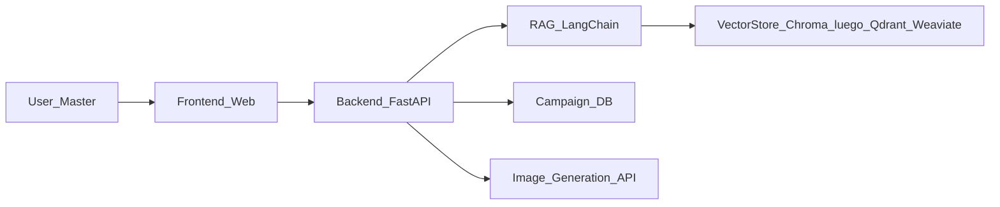

# Plan MVP Asistente para Másters de DnD

## Objetivo general

Construir una aplicación web que ayude a un máster de Dungeons & Dragons a:

- **Consultar reglas y lore** desde PDFs y otras fuentes mediante RAG.
- **Diseñar campañas largas** (tramas, arcos, sesiones) con apoyo de IA.
- **Generar ayudas visuales** (mapas, personajes, NPCs, escenas).
- **Adaptar las sesiones** según el progreso real de la partida.

Todo ello usando **Python + LangChain** en el backend y un frontend web sencillo pero usable.

### Base de datos vectorial

- **Primer prototipo**: usar **Chroma** con `persist_directory` para guardar los embeddings en disco de forma permanente (los PDFs no cambian, se indexan una vez).
- **Fases posteriores**: el código debe usar una **capa de abstracción** sobre el vector store (factory o interfaz que devuelva un `VectorStore`/`Retriever`). Así, más adelante se podrá cambiar Chroma por una base vectorial escalable (Qdrant, Weaviate, pgvector, etc.) sin tocar la lógica de RAG.

### Modelo de embeddings

- **Primer prototipo**: usar `**BAAI/bge-m3`** (funciona en **CPU**; GPU/CUDA es opcional para acelerar la ingesta).
- **Fases posteriores**: encapsular la creación de embeddings detrás de una **abstracción/factory** para poder cambiar a un modelo de mayor calidad (o a embeddings gestionados) sin tocar el resto del sistema.

---

## Fase 0: Estructura básica del proyecto

- **Estructura de repositorio**
  - `backend/` con un servicio Python (por ejemplo, FastAPI o Flask) que expondrá endpoints.
  - `frontend/` con una SPA sencilla (React/Vue/Svelte) o, si prefieres empezar aún más simple, plantillas HTML con Jinja2 en el propio backend.
  - Archivos base: `README.md`, `requirements.txt` (o `pyproject.toml`), `.gitignore`, configuración mínima.
- **Decisiones por defecto (se pueden cambiar luego)**
  - Backend: **FastAPI** (buena integración con Python/async y documentación automática).
  - Frontend inicial: **formulario HTML sencillo renderizado por el backend** para el primer prototipo; más tarde podremos migrar a SPA si hace falta.
- **Resultado de la fase**
  - Proyecto arrancable con `uvicorn` (o servidor equivalente) y una ruta de prueba (`/health` o `/ping`).

---

## Fase 1: Backend mínimo de RAG sobre un solo PDF (sin frontend aún)

Primero, centrarnos en que el "cerebro" funcione.

- **1.1. Ingesta de un PDF de DnD**
  - Crear en `backend/app/` algo como `[backend/app/ingest.py](backend/app/ingest.py)` con funciones para:
    - Cargar un PDF (ruta fija o carpeta `data/` para el MVP).
    - Partir en chunks (LangChain `CharacterTextSplitter` o similar).
  - Guardar los chunks en **Chroma** con `persist_directory` (por ejemplo `backend/storage/chroma_rules/`) para que los embeddings queden guardados de forma permanente.
  - Comprobar si ya existe el índice para ese PDF; si existe, no recalcular embeddings.
- **1.2. Abstracción del vector store**
  - Crear un módulo o factory (por ejemplo `[backend/app/vector_store.py](backend/app/vector_store.py)`) que:
    - Exponga una función `get_vector_store()` (o `get_retriever()`) que devuelva el store/retriever a usar.
    - En el prototipo, implementarlo con Chroma persistido; la firma debe ser independiente del backend concreto para poder sustituir Chroma por Qdrant/Weaviate más adelante.
- **1.3. Abstracción de embeddings**
  - Crear un módulo o factory (por ejemplo `[backend/app/embeddings.py](backend/app/embeddings.py)`) que:
    - Exponga `get_embeddings()` para devolver el modelo de embeddings.
    - Para el prototipo: `**BAAI/bge-m3`** (CPU por defecto).
    - Mantener la interfaz estable para poder cambiar a un modelo de mayor calidad en fases posteriores.
- **1.4. Pipeline de RAG en Python**
  - En `[backend/app/rag.py](backend/app/rag.py)` crear:
    - Uso de `Embeddings` desde la abstracción (prototipo: **bge-m3**).
    - Uso del retriever obtenido desde la capa de abstracción (no instanciar Chroma directamente en `rag.py`).
    - Una cadena de RAG: recuperar contextos + llamar al modelo de chat para responder.
  - Para el MVP, configurar un único modelo de lenguaje (por ejemplo, `gpt-4.x` o el que uses) vía LangChain.
- **1.5. Endpoint de API para preguntas de reglas/lore**
  - En `[backend/app/main.py](backend/app/main.py)` con FastAPI:
    - Endpoint `POST /api/query_rules` que reciba `{ "question": "..." }`.
    - Llame a la cadena RAG y devuelva una respuesta en JSON.
- **1.6. Interfaz mínima de línea de comandos (opcional, pero útil)**
  - Script `backend/scripts/ask_rules.py` que permita preguntar desde terminal.
- **Resultado de la fase**
  - Puedes cargar un **único PDF** (por ejemplo, el Manual del Jugador) y hacerle preguntas con un endpoint o script CLI.

---

## Fase 2: Frontend muy básico para consultar reglas y lore

Ahora ponemos una capa visual mínima para el máster.

- **2.1. Página HTML simple**
  - En `[backend/app/templates/index.html](backend/app/templates/index.html)` (si usamos plantillas Jinja2) o un HTML estático en `frontend/`:
    - Un textarea para la pregunta del máster.
    - Un botón "Preguntar".
    - Un área para mostrar la respuesta.
- **2.2. Llamada al endpoint RAG desde el frontend**
  - Pequeño script JS (`<script>` en la propia página o `static/app.js`) que haga `fetch('/api/query_rules')` con la pregunta.
- **2.3. Ajustes de UX básicos**
  - Indicador de carga mientras la IA responde.
  - Manejo de errores sencillo (mensaje si la API falla).
- **Resultado de la fase**
  - El máster puede **abrir la web**, escribir una duda de reglas o lore, y recibir una respuesta basada en el PDF.

---

## Fase 3: Modelo de datos para campaña y sesiones

Definir cómo representamos campañas largas y su progreso.

- **3.1. Definir entidades iniciales**
  - `Campaign`: nombre, sistema (5e, etc.), tono, nivel inicial, objetivos generales.
  - `Arc` (opcional para más detalle): subtramas dentro de la campaña.
  - `Session`: número de sesión, fecha prevista, estado (planificada, jugada), notas.
  - `Party`: lista breve de personajes jugadores y su nivel.
- **3.2. Persistencia mínima**
  - MVP: usar una **base de datos sencilla** (SQLite) vía SQLAlchemy o, más simple todavía, archivos JSON/YAML en `backend/data/campaigns/`.
  - Endpoints CRUD básicos:
    - `POST /api/campaigns` (crear campaña).
    - `GET /api/campaigns` (listar campañas).
    - `GET /api/campaigns/{id}` (ver detalle).
- **3.3. Integrar contexto de campaña con la IA**
  - Extender la cadena RAG para que, cuando se pregunte algo de "mi campaña actual", añada contexto:
    - Datos de la campaña seleccionada (resumen de trama, nivel de grupo, tono...).
- **Resultado de la fase**
  - Puedes **crear campañas**, almacenarlas y usar su información como contexto adicional para las respuestas.

---

## Fase 4: Generación de tramas, arcos y sesiones (planning narrativo)

Aquí empezamos con la parte creativa de IA.

- **4.1. Prompting y cadenas para diseño de campaña**
  - En `[backend/app/planning.py](backend/app/planning.py)` definir funciones:
    - `generate_campaign_pitch(campaign_settings)` para generar un pitch de campaña.
    - `generate_arcs(campaign, num_arcs)` para proponer arcos narrativos.
    - `generate_session_outline(campaign, arc, session_number)` para un esquema de sesión.
  - Estas funciones pueden usar el mismo modelo de lenguaje, con prompts estructurados.
- **4.2. Endpoints de planificación**
  - `POST /api/campaigns/{id}/generate_arcs`
  - `POST /api/campaigns/{id}/sessions/plan_next`
- **4.3. Integración con RAG**
  - Los prompts de planificación deben **inyectar extractos relevantes** del PDF (por ejemplo, secciones de monstruos o reglas específicas) para mantener coherencia con el sistema.
- **4.4. UI básica para ver y editar planes**
  - Página para una campaña concreta:
    - Ver arcos sugeridos.
    - Ver lista de sesiones y su resumen.
    - Permitir al máster editar el texto generado (guardando cambios).
- **Resultado de la fase**
  - El sistema puede **proponer una estructura de campaña y sesiones** coherente con DnD y el PDF.

---

## Fase 5: Generación de guiones y detalles para cada sesión

Subimos de nivel en detalle.

- **5.1. Guion de sesión**
  - Función `generate_session_script(campaign, session)`:
    - Estructura: introducción, escenas, posibles giros, ganchos para la siguiente sesión.
    - Añadir secciones tipo: "Si los jugadores hacen X, responde con Y".
- **5.2. Fichas de NPCs y localizaciones**
  - Funciones auxiliares:
    - `generate_npc(campaign, role)` (tabernero, villano, contacto, etc.).
    - `generate_location(campaign, type)` (ciudad, dungeon, bosque, etc.).
  - Estas funciones pueden llamarse desde la generación de guion o desde la UI a demanda.
- **5.3. UI de sesión**
  - Vista por sesión:
    - Mostrar resumen, guion y lista de NPCs/localizaciones clave.
    - Botones para "Regenerar" o "Refinar" secciones específicas.
- **Resultado de la fase**
  - El máster obtiene **guiones bastante detallados** para cada sesión, con NPCs y localizaciones generadas.

---

## Fase 6: Generación de mapas e imágenes (NPCs, escenas)

Una vez la parte textual funciona, añadimos generación de imágenes.

- **6.1. Integración con un modelo de imagen**
  - Diseñar una interfaz genérica en `[backend/app/images.py](backend/app/images.py)`:
    - `generate_npc_image(npc_description)`
    - `generate_map_image(location_description)`
  - Internamente, llamar al proveedor de imágenes (por ejemplo, API de imagen del mismo proveedor que uses para texto, o Stable Diffusion vía un servicio externo).
- **6.2. Endpoints de generación de imágenes**
  - `POST /api/npcs/{id}/generate_image`
  - `POST /api/locations/{id}/generate_map`
- **6.3. UI para previsualizar y guardar**
  - En la vista de sesión o campaña:
    - Botón "Generar retrato" junto a cada NPC.
    - Botón "Generar mapa" junto a cada localización.
    - Mostrar la imagen resultante (almacenada en `media/` o similar) y permitir descargarla.
- **Resultado de la fase**
  - El máster puede **generar retratos y mapas** asociados a los elementos narrativos ya definidos.

---

## Fase 7: Adaptación dinámica según el progreso de la partida

Este es el paso que convierte la herramienta en un verdadero asistente continuo.

- **7.1. Modelo de "estado de campaña"**
  - Extender `Campaign` y `Session` con:
    - Resumen de lo que **realmente ha ocurrido** (no solo lo planeado).
    - Estado de NPCs (vivos, muertos, aliados, enemigos).
    - Cambios importantes en el mundo.
- **7.2. Registro rápido tras cada sesión**
  - UI para que el máster, tras la sesión, introduzca en 3-5 frases lo que pasó.
  - Endpoint `POST /api/sessions/{id}/update_log`.
- **7.3. Adaptación de futuras sesiones**
  - Función `adapt_future_sessions(campaign)` que:
    - Lea el historial de sesiones jugadas.
    - Recalcule/resuma el estado actual.
    - Genere propuestas modificadas para las próximas sesiones (por ejemplo, cambiar villano, ajustar dificultad, mover pistas).
- **7.4. Integración con RAG**
  - La cadena de RAG para preguntas del máster debe considerar ahora:
    - PDF de reglas/lore.
    - Datos de campaña y log de sesiones.
- **Resultado de la fase**
  - El sistema **reestima y adapta el plan** de campaña automáticamente según lo que ha pasado en la mesa.

---

## Fase 8: Mejora de UX, multi-campaña y multi-fuente

Con el MVP funcional, pulimos y escalamos poco a poco.

- **8.1. Migración de base vectorial (Chroma → escalable)**
  - Sustituir Chroma por una base vectorial que escale mejor en producción (por ejemplo **Qdrant**, **Weaviate** o **pgvector**), usando la capa de abstracción ya definida en Fase 1.
  - Script de migración: leer embeddings y metadatos desde Chroma persistido y volcarlos a la nueva base (o re-ingestar los PDFs una vez configurada la nueva DB).
- **8.2. Upgrade de embeddings (bge-m3 → mayor calidad)**
  - Cambiar `BAAI/bge-m3` por un modelo de embeddings de mayor calidad (y/o ejecutar en GPU si está disponible), usando la abstracción de embeddings definida en Fase 1.
  - Validar recuperación (precision/recall) con un set pequeño de preguntas representativas de reglas/lore.
- **8.2. Múltiples PDFs y fuentes**
  - Permitir subir varios PDFs (Manual del Jugador, Guía del Dungeon Master, módulos oficiales, notas propias).
  - Crear una capa de metadatos para marcar origen de cada chunk (de qué libro viene, qué capítulo).
  - UI para seleccionar qué fuentes usar para una campaña concreta.
- **8.3. Autenticación ligera (si se necesita)**
  - Añadir login simple (email + contraseña o OAuth) para soportar múltiples usuarios/másters.
- **8.4. Refinar interfaz web**
  - Si empezó con HTML básico, migrar a un frontend SPA (React/Vue) con componentes dedicados:
    - Vista de campañas.
    - Vista de planificación.
    - Vista de sesión en vivo.
- **8.5. Deploy**
  - Desplegar el backend en un servicio tipo Railway/Render/Fly.io o un VPS.
  - Configurar almacenamiento persistente para PDFs, vector store e imágenes.

---

## Diagrama de arquitectura (vista simple)

---

## Estrategia de desarrollo incremental

- **Paso a paso**
  - Completar **Fase 1** hasta poder preguntar a un PDF vía API.
  - Añadir **Fase 2** para tener una UI mínima.
  - Implementar **Fase 3 y 4** para el núcleo de campañas y planificación.
  - Luego iterar con **Fase 5–7** según lo que te parezca más prioritario (detalles de guiones vs adaptación dinámica).
- **Pruebas y validación**
  - Después de cada fase, probar con un caso real: una mini campaña o sesión.
  - Anotar qué te falta durante tu uso real como máster y usarlo para priorizar la siguiente iteración.

