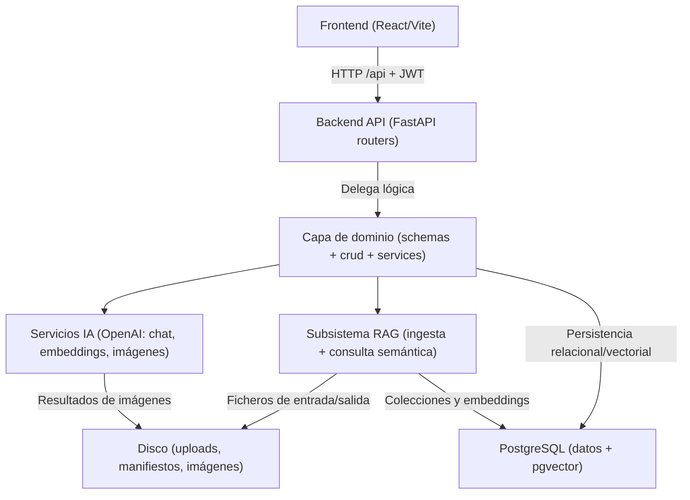

# DnD Helper

DnD Helper es una aplicación web para directores/as de juego de Dungeons & Dragons (5e) que combina dos capacidades en un único flujo:

- gestión de campañas, mundos y sesiones;
- consultas inteligentes tipo RAG sobre documentación (manuales y material de campaña).

La idea del proyecto es que puedas preparar y evolucionar una campaña completa desde una interfaz única, con apoyo de modelos de lenguaje, almacenamiento relacional y búsqueda semántica.

---

## Datos sobre la entrega:

Enlace a la presentación de slides: https://docs.google.com/presentation/d/1Wrj_74uTbKG1_ubZddlpIlovYMLEoHJFBrxM4vEWGUc/edit?usp=sharing

Enlace al entorno desplegado: https://yanfer.tech/

Nota: Al trabajar en dos equipos distintos GitHub no ha reconocido correctamente los commits desde un equipo y se los ha asignado a otro usuario, pero, a día de este commit (24/03/2026), son todos míos.

---

## a. Descripción general del proyecto

DnD Helper está construido como una solución full-stack con backend en FastAPI, frontend en React y PostgreSQL como base de datos principal (incluyendo vectores con pgvector).

De forma práctica, el sistema te permite:

- crear campañas a partir de un brief;
- generar y revisar historias, outlines y sesiones;
- vincular campañas con mundos y activos visuales;
- subir documentos (PDF, TXT, DOCX) para consultas con recuperación semántica.

### Cómo funciona a nivel funcional

1. El usuario se registra o inicia sesión.
2. Define ajustes (por ejemplo, clave de OpenAI en Ajustes).
3. Crea campaña/mundo/sesiones o sube documentación.
4. Consulta por lenguaje natural:
   - **scope `rules`** para manuales/reglas;
   - **scope `campaigns_general`** para referencias generales de campañas;
   - **scope `campaign`** para una campaña concreta.

### Aislamiento por usuario

Cada cuenta trabaja sobre sus propios recursos (`owner_id`):

- campañas, mundos y sesiones;
- trabajos de ingesta;
- colecciones RAG en pgvector;
- ficheros subidos en `backend/data/uploads/<owner_id>/`.

Un usuario administrador puede operar sobre recursos de otros usuarios cuando procede.

---

## b. Stack tecnológico utilizado

### Backend y API

- **Python** (entorno local recomendado 3.11+, imagen Docker basada en 3.12).
- **FastAPI** + **Uvicorn**.
- **SQLAlchemy** + **Alembic** para ORM y migraciones.
- **PyJWT** + `bcrypt` para autenticación.

### Datos y búsqueda semántica

- **PostgreSQL** como base relacional.
- **pgvector** para embeddings y recuperación vectorial.
- **LangChain** (`langchain-openai`, `langchain-postgres`, splitters, loaders).
- Ingesta de documentos con soporte para **PDF/TXT/DOCX**.

### Frontend

- **React 19** + **React Router 7**.
- **TypeScript** + **Vite 8**.
- En desarrollo, Vite usa proxy `/api` hacia `http://127.0.0.1:8000`.

### Infra y despliegue

- **Docker Compose** con servicios: `db`, `backend`, `ingest-worker`, `frontend` (+ perfiles `test` y `e2e`).
- **Kubernetes** (manifiesto de referencia en `deploy/k8s/all-in-one.yaml`).
- **Nginx** para servir frontend en contenedor y enrutar `/api` y `/admin` al backend.

### Testing

- **pytest** para backend.
- **Playwright** para E2E de frontend.

---

## c. Información sobre su instalación y ejecución

Esta sección está pensada para que puedas levantar el proyecto sin adivinar pasos.

### 1) Requisitos previos

- Python 3.11+ (3.12 también válido).
- Node.js LTS + npm.
- PostgreSQL con extensión `vector` (pgvector).
- (Opcional, pero habitual) clave OpenAI para chat/embeddings/imágenes.
- Docker + Compose v2 (si usarás contenedores).

### 2) Instalación en local (desarrollo)

Desde la raíz del repositorio:

```bash
python -m venv .venv
source .venv/bin/activate
pip install -U pip
pip install -r requirements.txt
```

Instala frontend:

```bash
cd frontend
npm install
cd ..
```

### 3) Configuración de entorno

Crea tu `.env` a partir del ejemplo:

```bash
cp .env.example .env
```

Variables mínimas recomendadas:

- `POSTGRES_URL`: conexión principal a PostgreSQL.
- `JWT_SECRET`: secreto de tokens (cámbialo siempre en entornos reales).
- `POSTGRES_TEST_URL`: base aislada para tests.

Variables de arranque importantes:

- `ADMIN_USERNAME` / `ADMIN_PASSWORD`: crea/actualiza admin al iniciar API.
- `SETUP_MASTER_PASSWORD`: necesaria para instalación inicial vía `/setup` cuando no existe ningún admin.
- `INGEST_WORKER_AUTOSTART` y `INGEST_WORKER_COUNT`: controlan workers de ingesta al arrancar uvicorn.

Modelos IA configurables:

- `OPENAI_MODEL` (chat).
- `OPENAI_EMBEDDINGS_MODEL` (embeddings).
- `OPENAI_IMAGE_MODEL` (imágenes).

La generación de imágenes de mundos está habilitada siempre que el usuario tenga una clave OpenAI activa en Ajustes.

### 4) Base de datos y migraciones

Primero habilita pgvector en tu Postgres:

```sql
CREATE EXTENSION IF NOT EXISTS vector;
```

Después aplica migraciones desde la raíz:

```bash
alembic upgrade head
```

### 5) Ejecución en local

#### Backend

```bash
uvicorn backend.app.main:app --reload
```

Endpoints útiles:

- `http://127.0.0.1:8000/health`
- `http://127.0.0.1:8000/health/ready`
- `http://127.0.0.1:8000/docs`
- `http://127.0.0.1:8000/admin`

#### Frontend

En otra terminal:

```bash
cd frontend
npm run dev
```

Vite normalmente arranca en `http://127.0.0.1:5173` y redirige `/api` al backend.

### 6) Ingesta RAG de documentos

Puedes cargar documentos de dos maneras:

- por UI (`/documentos`) para cola asíncrona;
- por CLI (scripts de ingesta).

Ejemplos CLI:

```bash
python -m backend.scripts.ingest_pdf --pdf backend/data/manual.pdf
python -m backend.scripts.ingest_pdfs --dir backend/data
```

Para compartir colección con un usuario concreto:

```bash
python -m backend.scripts.ingest_pdf --pdf backend/data/manual.pdf --owner-id <uuid_usuario>
```

#### Nota importante sobre workers

- En local, por defecto el backend puede lanzar workers (`INGEST_WORKER_AUTOSTART=true`).
- En Compose, existe servicio dedicado `ingest-worker`, y el backend lleva `INGEST_WORKER_AUTOSTART=false` para evitar duplicidades.

### 7) Ejecución con Docker Compose

1. Revisa `.env` (incluye `JWT_SECRET`; y si no hay admin creado, define `SETUP_MASTER_PASSWORD`).
2. Levanta servicios:

```bash
docker compose up -d --build
```

URLs habituales:

- Frontend (Nginx): `http://localhost:80`
- Backend API: `http://localhost:8000`
- PostgreSQL: `localhost:5432`

Servicios principales en Compose:

- `db` (pgvector/pg16),
- `backend`,
- `ingest-worker`,
- `frontend` (nginx con `BACKEND_UPSTREAM`).

Perfiles opcionales:

- `test` para pytest en contenedor.
- `e2e` para Playwright en contenedor.

### 8) Despliegue Kubernetes (referencia)

Hay un manifiesto completo en `deploy/k8s/all-in-one.yaml` con:

- Secret de aplicación y base de datos;
- StatefulSet + Service de PostgreSQL;
- Deployment + Service del backend;
- Deployment separado para `ingest-worker`;
- Deployment + Service de frontend.

Flujo básico:

1. Ajusta credenciales/URLs del Secret.
2. Publica imágenes o usa imágenes accesibles en tu clúster.
3. Aplica el manifiesto:

```bash
kubectl apply -f deploy/k8s/all-in-one.yaml
```

### 9) Pruebas

#### Backend (pytest)

```bash
./scripts/test.sh
```

o en Windows:

```powershell
./scripts/test.ps1
```

#### Suite completa (pytest + E2E)

```bash
./scripts/test-all.sh
```

o en Windows:

```powershell
./scripts/test-all.ps1
```

También puedes usar Compose con perfiles `test`/`e2e`.

---

## d. Estructura del proyecto

Esta sección describe el código por **bloques funcionales** y cómo se conectan entre sí, para que puedas ubicar rápido dónde tocar según el tipo de cambio.

### Visión arquitectónica (alto nivel)



### Bloques principales del código fuente

#### 1) Backend HTTP y composición de aplicación

- `backend/app/main.py`: punto de entrada FastAPI, middlewares, registro de routers, endpoints de salud y ciclo de vida.
- `backend/app/api/`: capa de exposición HTTP por contexto funcional:
  - `auth.py` (registro/login/me),
  - `campaigns.py`, `sessions.py`, `worlds.py` (dominio de juego),
  - `rag.py` (consultas y cola de documentos),
  - `settings.py` (claves por usuario),
  - `setup.py` (instalación inicial).

Relación: los routers validan entrada/salida, delegan lógica en capa de dominio/servicios y devuelven respuestas HTTP.

#### 2) Núcleo de dominio y reglas de negocio

- `backend/app/schemas.py`: contratos Pydantic (request/response).
- `backend/app/models.py`: entidades ORM (usuarios, campañas, sesiones, trabajos de ingesta, etc.).
- `backend/app/crud.py`: operaciones de persistencia y consultas de negocio.
- `backend/app/services/`: lógica no trivial (RAG, generación, imágenes, etc.).

Relación: es la capa donde vive el comportamiento real; API y scripts entran aquí para evitar duplicar lógica.

#### 3) Configuración, seguridad y contexto

- `backend/app/config.py`: settings centralizados desde entorno.
- `backend/app/db.py`: creación de engine/sesiones SQLAlchemy.
- Componentes de auth/contexto (`auth_middleware`, `owner_context`, repos de usuario): controlan identidad, permisos y aislamiento por `owner_id`.

Relación: este bloque atraviesa todo el backend; cualquier endpoint sensible depende de él para autorizaciones y scoping de datos.

#### 4) Subsistema RAG (documentos y consulta semántica)

- Entrada HTTP en `backend/app/api/rag.py`.
- Ingesta asíncrona mediante trabajos en BD + worker (`backend/scripts/ingest_worker.py`).
- Scripts utilitarios de carga (`ingest_pdf.py`, `ingest_pdfs.py`).
- Integración vectorial y utilidades de colección por usuario en módulos RAG del backend.

Relación: la API encola documentos, el worker los procesa y actualiza estado, y las consultas leen el índice vectorial por alcance (`rules`, `campaigns_general`, `campaign`).

#### 5) Subsistema de generación de contenido e imágenes

- Generación textual de campañas/sesiones/mundos dentro de servicios del backend.
- Generación de imágenes bajo demanda en `backend/app/services/world_image_service.py`.
- Plantillas de prompts en `backend/prompt_templates/`.

Relación: los servicios consumen claves/modelos configurados por usuario y escriben resultado en BD o en `backend/storage/` según el tipo de activo.

#### 6) Frontend SPA (presentación y flujo de usuario)

- `frontend/src/router.tsx`: mapa de navegación y protección de rutas.
- `frontend/src/pages/`: pantallas por caso de uso (campañas, mundos, consultas, documentos, ajustes).
- `frontend/src/components/`: piezas reutilizables de UI y layout.
- `frontend/src/lib/api.ts`: cliente HTTP hacia backend.

Relación: el frontend no contiene reglas de negocio críticas; orquesta formularios/estado de UI y delega operaciones al backend vía API.

#### 7) Infraestructura y operación

- `docker-compose.yml`: topología local/servidor simple (db + backend + ingest-worker + frontend).
- `deploy/k8s/all-in-one.yaml`: despliegue de referencia en Kubernetes.
- `scripts/`: tests, healthchecks y entrypoints auxiliares.
- `alembic/`: migraciones de esquema.

Relación: este bloque no implementa funcionalidad de negocio, pero garantiza que los bloques anteriores arranquen, migren y se supervisen correctamente.

### Cómo se relacionan los bloques en un flujo real

Ejemplo: subida de un manual y consulta posterior

1. Frontend envía archivo a `POST /api/upload_pdf`.
2. Router RAG valida y crea job de ingesta en PostgreSQL.
3. `ingest-worker` toma el job, procesa el documento y actualiza vectores/estado.
4. Usuario pregunta en `/consultas`; backend busca por embeddings y devuelve respuesta con fuentes.

Ejemplo: generación de una sesión

1. Frontend invoca endpoint de campañas/sesiones.
2. Router delega en servicios de generación (prompts + modelo).
3. Servicio persiste borrador/final en entidades de dominio.
4. Frontend refresca datos y muestra el resultado al usuario.

### Árbol físico del repositorio (referencia rápida)

```text
dndhelper/
├── README.md
├── .env.example
├── requirements.txt
├── requirements-dev.txt
├── alembic.ini
├── docker-compose.yml
├── alembic/
│   └── versions/
├── backend/
│   ├── Dockerfile
│   ├── docker-entrypoint.sh
│   ├── docker-entrypoint-worker.sh
│   ├── app/
│   │   ├── main.py
│   │   ├── config.py
│   │   ├── db.py
│   │   ├── models.py
│   │   ├── schemas.py
│   │   ├── crud.py
│   │   ├── api/
│   │   │   ├── auth.py
│   │   │   ├── campaigns.py
│   │   │   ├── rag.py
│   │   │   ├── sessions.py
│   │   │   ├── settings.py
│   │   │   ├── setup.py
│   │   │   └── worlds.py
│   │   └── services/
│   ├── scripts/
│   │   ├── ingest_pdf.py
│   │   ├── ingest_pdfs.py
│   │   ├── ingest_worker.py
│   │   └── health_ingest.py
│   ├── admin_ui/
│   ├── data/
│   ├── prompt_templates/
│   └── storage/
├── frontend/
│   ├── Dockerfile
│   ├── Dockerfile.e2e
│   ├── package.json
│   ├── vite.config.ts
│   ├── nginx.docker.conf
│   └── src/
│       ├── main.tsx
│       ├── App.tsx
│       ├── router.tsx
│       ├── components/
│       └── pages/
├── deploy/
│   └── k8s/
│       └── all-in-one.yaml
└── scripts/
    ├── test.sh
    ├── test.ps1
    ├── test-all.sh
    ├── test-all.ps1
    ├── docker-test-entrypoint.sh
    ├── healthcheck-backend.sh
    ├── healthcheck-postgres.sh
    └── healthcheck-nginx.sh
```

---

## e. Funcionalidades principales

### 1) Autenticación y control de acceso

- **Registro e inicio de sesión con JWT**: el sistema emite token de acceso y lo usa en las rutas protegidas de la API.
- **Contexto de usuario por petición**: cada operación se ejecuta bajo un `owner_id`, evitando cruces de datos entre cuentas.
- **Rol administrador**: puede consultar/gestionar recursos de otros usuarios cuando la ruta lo permite (por ejemplo en operaciones RAG con `target_owner_id`/`for_owner_id`).
- **Instalación inicial segura**: si no existe admin en BD, el flujo `/setup` permite bootstrap controlado con `SETUP_MASTER_PASSWORD`.
- **Gestión de claves por usuario**: cada cuenta guarda su clave OpenAI en Ajustes, sin exponer secretos en respuestas.

Qué aporta en la práctica: aislamiento multiusuario real, trazabilidad de acciones y una primera configuración operativa sin intervención manual en base de datos.

### 2) Gestión de campañas

- **CRUD completo de campañas**: alta, consulta, edición parcial y borrado.
- **Pipeline de contenido asistido**:
  - generación de **brief** (base narrativa inicial),
  - generación y consolidación de **historia** (`draft` y `final`),
  - generación y aprobación de **outline**.
- **Estados de trabajo iterables**: una campaña puede reabrirse para seguir refinando contenido ya generado.
- **Vinculación con mundo**: una campaña puede relacionarse con un `world_id` para mantener coherencia de ambientación y activos.
- **Modo asistido/wizard**: acelera creación inicial con generación automática de bloques clave.

Qué aporta en la práctica: una campaña no es solo un registro, sino un flujo editorial con borradores, aprobaciones y revisión continua.

### 3) Gestión de mundos

- **Generación y edición estructurada**: mundos con contenido textual editable en fases (borrador/final).
- **Contexto creativo explícito**: soporte para tono, temas y pitch, que luego se reutilizan en sesiones y material asociado.
- **Activos visuales bajo demanda**:
  - mapa global,
  - mapas locales/regionales,
  - emblemas de facciones,
  - retratos de personajes.
- **Persistencia de archivos**: las imágenes se guardan en almacenamiento del backend y se sirven por API para uso en frontend.
- **Condición operativa simple**: si hay clave OpenAI activa del usuario, la generación de imágenes está disponible.

Qué aporta en la práctica: centraliza el worldbuilding (texto + visuales) en un único módulo reutilizable por el resto de la aplicación.

### 4) Gestión de sesiones

- **Generación masiva por campaña**: creación automática de varias sesiones en una sola operación (`session_count`).
- **Consulta flexible**:
  - listado por campaña concreta,
  - listado global del propietario con paginación (`limit/offset`).
- **Ciclo de vida de sesión**:
  - edición de borrador,
  - aprobación de versión final,
  - reapertura para re-trabajar contenido,
  - eliminación cuando deja de ser útil.
- **Coherencia narrativa**: las sesiones se apoyan en información ya consolidada de campaña y mundo.

Qué aporta en la práctica: permite planificar largo plazo y, a la vez, adaptar cada sesión al feedback real de la mesa.

### 5) Consultas RAG y documentos

- **Consulta semántica principal**: `POST /api/query_rules`, con respuesta y fuentes recuperadas.
- **Tres alcances de búsqueda**:
  - `rules`: manuales/reglamento del usuario,
  - `campaigns_general`: repositorio general de referencias de campaña,
  - `campaign`: contexto acotado a una campaña concreta.
- **Subida de documentos con cola asíncrona**: `POST /api/upload_pdf` admite `PDF`, `TXT`, `DOCX`, valida formato/tamaño y encola trabajos.
- **Seguimiento de ingesta**: `GET /api/ingest_jobs` permite ver estado, progreso y resultado (`indexed`, `unchanged`, `empty`, `failed`).
- **Worker desacoplado**: `ingest-worker` procesa la cola y recupera trabajos pendientes tras reinicios.
- **Limpieza controlada**: `POST /api/rag/clear` borra colecciones y artefactos por objetivo (`manuals`, `campaign`).

Qué aporta en la práctica: consultas útiles en lenguaje natural sobre documentación propia, sin depender de memoria manual ni búsquedas lineales.

### 6) Operación y observabilidad básica

- **Salud de servicio**:
  - `/health` para liveness,
  - `/health/ready` para readiness con comprobación de base de datos.
- **Contrato API autocontenido**: `/docs` (OpenAPI/Swagger) para explorar endpoints y probar integraciones.
- **Topología adaptable**:
  - modo local (backend + frontend dev + worker opcional),
  - Docker Compose con worker dedicado,
  - Kubernetes con despliegues separados.
- **Migraciones versionadas**: Alembic como mecanismo estándar para evolución de esquema.
- **Testing integrado en repositorio**:
  - scripts backend (`test.sh`, `test.ps1`),
  - suite completa con E2E (`test-all.sh`, `test-all.ps1`),
  - perfiles de Compose para pruebas reproducibles.

Qué aporta en la práctica: despliegues más previsibles, diagnóstico rápido ante fallos y menor fricción para desarrollo colaborativo.

---

Si vas a desplegar en producción, revisa especialmente secretos (`JWT_SECRET`, contraseñas DB, `SETUP_MASTER_PASSWORD`), políticas de red y persistencia de volúmenes.
